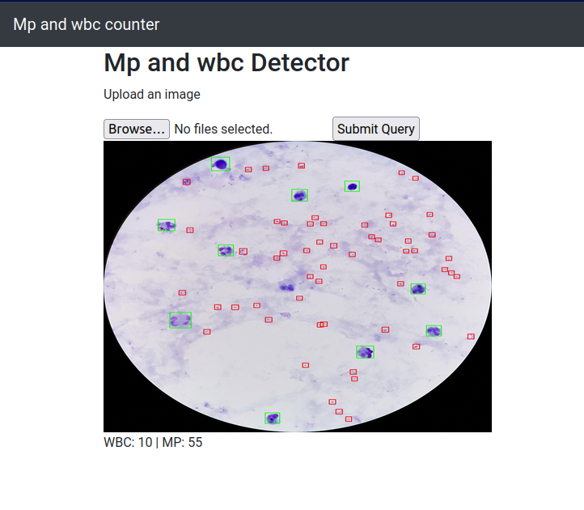

## Malaria diagnostics in thick blood smear

A demo app that counts malaria parasites and white blood cells in thick blood smears

Visit https://malaria-diag-zgymkx5l6a-uc.a.run.app/ and try out the demo images in [test_images](test_images) folder.

## References 

1. @data{qsqw-a673-18,
doi = {10.21227/qsqw-a673},
url = {https://dx.doi.org/10.21227/qsqw-a673},
author = {Yang, Feng and Poostchi, Mahdieh and Yu, Hang and Zhou, Zhou and Silamut, Kamolrat and Yu, Jian and Maude, Richard J. and Jaeger, Stefan and Antani, Sameer },
publisher = {IEEE Dataport},
title = {Malaria Thick Blood Smears},
year = {2018} } 